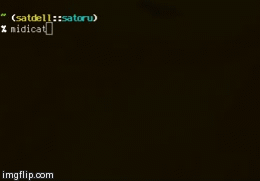

# Midicat

cat/tailf for MIDI input events



## Installation

Install it yourself as:

    $ gem install midicat

## Usage

Just execute

```
$ midicat
```

after installing it

note: you should have gem executables directory in `$PATH` (`gem env gempath` shows the path to append your `$PATH`)

## Contributing

1. Fork it ( https://github.com/polamjag/midicat/fork )
2. Create your feature branch (`git checkout -b my-new-feature`)
3. Commit your changes (`git commit -am 'Add some feature'`)
4. Push to the branch (`git push origin my-new-feature`)
5. Create a new Pull Request
